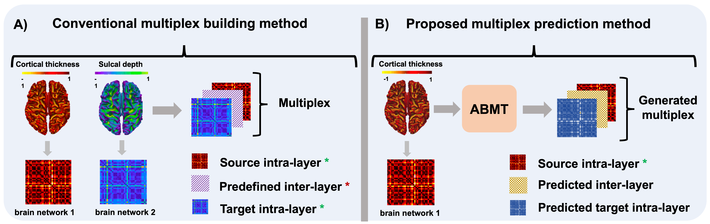
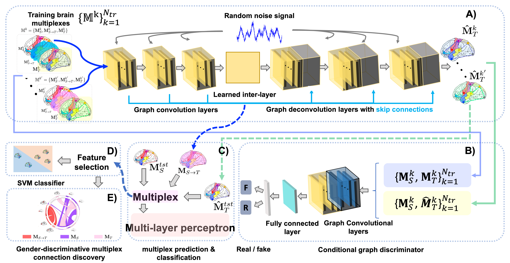
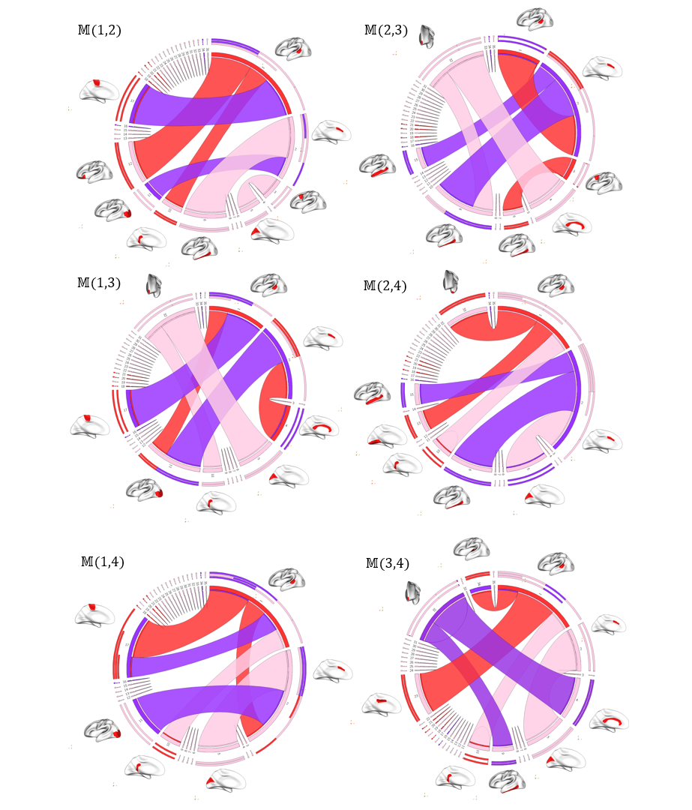

# **ABMT in Python (Adversarial Brain Multiplex Translator)**

ABMT (Adversarial Brain Multiplex Translator) for brain graph translation using geometric generative adversarial network (gGAN). Please contact: [mr.ahmednebli@gmail.com](mailto:mr.ahmednebli@gmail.com) for further inquiries. Thanks.

Existing conventional multiplex building methods aim to create a brain multiplex uses two ground truth intra layers and a predefined convolutional inter-layer. However, our method uses only one intra-layer to predict both brain multiplex target intra-layer and the inter-layer capturing the high-order relationship between both intra-layers (i.e., network to network relationship).

# Detailed proposed ABMT framework

Adversarial Brain Multiplex Translator (ABMT) is the first work for predicting brain multiplexes from a source network using geometric adversarial learning to investigate gender differences in the human brain. Given a set of morphological brain multiplexes, we train a brain network translator to learn how to translate a source multiplex intra-layer to the target intra-layer. The translator architecture mimics that of U-Net comprising encoding and decoding layers with additional skip connections to pass over sample-specific representations to the encoding layers. The conditional network discriminator inputs for training sets of pairs of multiplex layers: in order to discriminate the pair including the ground truth from the predicted ones by the translator for each training subject. We produce the final multiplex by stacking the source intra-layer, the predicted intra-layer, and the learned inter-layer. Then, we train a multi-layer perceptron (MLP) that classifies each subject&#39;s multiplex into male and female classes. The MLP helps predict the multiplex via supervision by sample labels. We further perform feature selection followed by an independent support vector machine (SVM) classifier. We hypothesize that this would ensure a better classification since the SVM has not interfered in the learning process. The identification of the most gender discriminative connectivities is shown in the circular graphs. Notably, these connectivities belong to both intra-layers as well as the high-order inter-layer.

# Libraries to pre-install in Python

Numpy: [https://numpy.org/](https://numpy.org/)

TensorFlow: [https://www.tensorflow.org/](https://www.tensorflow.org/)

Scikit-learn: [https://scikit-learn.org/stable/install.html](https://scikit-learn.org/stable/install.html)

#

# Demo

ABMT is coded in Python 3. GPU is not a requirement to run the code. However, for faster training, it is mandatory to install TensorFlow-gpu.

To run ABMT please run main.py. If you require to run a demo for the first time , please run main.py at least for 1 epoch then run demo.py.

#

**Data preparation**

We simulated a random graph dataset, each representing a brain network (source and target), using the function Utils\_.py. Each graph contains 35 brain regions. To load your own data please modify the function load\_data in Utils\_.py to upload your own dataset.

To train and evaluate ABMT code for classification on other datasets, you need to upload your data as a structure including:

• A tensor of size (N × m ×m) containing N symmetric matrices each one representing a subject graph of size (m × m). N denotes the number of subjects and m denotes the number of nodes (regions of interest in our case).
 • A (N ×1) label list including the label of each subject in the dataset (male or female).

The ABMT outputs are:

• A matrix of size (N ×m × m) storing the network of the predicted subjects.

# Dataset

We used Brain Genomics Superstruct Project (GSP) dataset, where participants provided written informed consent under guidelines established by the Partners Health Care Institutional Review Board and the Harvard University Committee on the Use of Human Subjects in Research. T1-weighted images were acquired using a 1.2mm isotropic resolution on a Siemens head-only 3T scanner (Allegra, Siemens Medical System, Erlangen, Germany) with a circularly polarized head coil, 70 transverse slices were acquired by using a turbo spin-echo (TSE) sequences: TR = 7380 nos TE =119 mss with a Flip Angle = 150°, and resolution =1.25 × 1.25 × 1.95. Test-retest reliability was established with a correlation range from 0.75 for the estimated cortical thickness of the right medial prefrontal cortex to 0.99 for the estimated intracranial volume. We used FreeSurfer processing pipeline to ultimately derive both left and right morphological cortical networks (CMNs). We first constructed both left and right hemispheric surfaces then we parcellated each cortical surface into 35 regions using Desikan-Killiany atlas. For each subject, we created 4 CMNs of size 35×35 derived from the following cortical attributes respectively: the mean maximum principal curvature, the cortical thickness, the sulcal depth, and the mean average curvature.

# Example Results

We show a visualization of generated brain graphs from two randomly chosen source subjects. We also show a qualitative difference between our proposed ABMT and a comparison method GT-GAN.

We show the most gender-discriminative connectivities found in each layer of the multiplex. These connectivities are represented as circular graphs.

#

# Related references

Guo, Xiaojie, Lingfei Wu, and Liang Zhao. &quot;Deep graph translation.&quot; arXiv preprint arXiv:1805.09980 (2018). [[https://arxiv.org/abs/1805.09980](https://arxiv.org/abs/1805.09980)]

Lisowska, Anna, et al. &quot;Joint pairing and structured mapping of convolutional brain morphological multiplexes for early dementia diagnosis.&quot; Brain connectivity 9.1 (2019): 22-36. [[https://www.liebertpub.com/doi/full/10.1089/brain.2018.0578](https://www.liebertpub.com/doi/full/10.1089/brain.2018.0578)]

Holmes, Avram J., et al. &quot;Brain Genomics Superstruct Project initial data release with structural, functional, and behavioral measures.&quot; Scientific data 2.1 (2015): 1-16. [[https://www.nature.com/articles/sdata201531](https://www.nature.com/articles/sdata201531)]

# Please cite the following paper when using ABMT:

@article{nebli2020,  
 title={Adversarial Brain Multiplex Prediction From a Single Brain Network with Application to Gender Fingerprinting}, 
 author={Nebli, Ahmed and Rekik, Islem}, 
 journal={Medical Image Analysis}, 
 volume={??}, 
 pages={???}, 
 year={2020}, 
 publisher={Elsevier} 
 } 

# License

Our code is released under MIT License (see LICENSE file for details).
